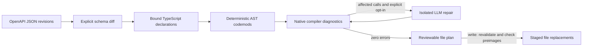

# AutoPatch

Reviewable examples now cover [Stripe, Brex, and Ramp](examples/README.md).
Use [`--report`](docs/review-report.md) for the standalone review UI, or the
[GitHub workflow](docs/schema-migration-workflow.md) to propose verified draft PRs
when checked-in target schemas change. Provider coverage is bounded and documented.

AutoPatch migrates explicitly bound TypeScript API contracts and consumers using
**ts-morph symbol references and native TypeScript diagnostics**. Deterministic
codemods handle supported mechanical changes. Optional LLM repair handles broken
call expressions with only that expression and the schema diff as context.

Built for the Puentes / Antigravity Capital technical evaluation. This repository
contains a working CLI, a compiler-gated migration runner, real OpenAPI/SDK
fixtures, and Vitest tests. It does not claim to migrate every OpenAPI change.

## Run it

Requires Node.js **24** and npm. The runtime and dev dependencies are pinned.

```sh
npm ci
npm run typecheck   # native compiler diagnostics in memory; no shell tsc
npm test           # real AST projects, filesystem transactions, and CLI tests
npm run demo       # verified preview against the included fixture; no writes
npm run evaluate   # offline corpus: runtime observations and expected rejections
npm run test:integration # pinned Orval SDK, CLI writes, real loopback HTTP
```

The demo migrates `createUser` → `registerUser` and `CreateUser.name` →
`CreateUser.displayName`. It preserves the `saveUser` import alias and the local
`name` variable, expanding `{ name }` to `{ displayName: name }`. Unrelated
objects with a `name` field remain unchanged. Structural producers outside the
compiler symbol references are rejected until their field flow can be proven.

```sh
npm run autopatch -- \
  --from tests/fixtures/openapi-v1.json \
  --to tests/fixtures/openapi-v2.json \
  --project tests/fixtures/target/tsconfig.json \
  --bindings tests/fixtures/target/bindings.json \
  --json
```

By default the CLI previews a migration. `--json` includes exact before/after
source for every changed file. Add `--write` to persist the verified result.
Copy the fixture target to a temporary directory before experimenting with writes.

## Pipeline and invariants



1. Load the target project and require a clean baseline. The runner enables
   `strict` and every strict suboption, disables `noCheck` and library-check
   suppression, and performs no emit. Explicit permissive target flags cannot
   weaken the gate.
2. Match operations by **HTTP method + path**. Resolve SDK declarations through
   explicit bindings, never through a project-wide name guess.
3. Rename symbols with the TypeScript language service. Update interface
   property declarations through ts-morph AST APIs. No regex source replacement.
4. Check the **complete unsaved Project** with `getPreEmitDiagnostics()`.
   Errors outside supported call-site boundaries require manual work.
5. When explicitly enabled, repair affected bound API calls as one batch. Each
   response must parse as a single call with the same callee. Reject casts,
   non-null assertions, compiler directives, and inferred `any`/`never` values.
   Only a batch producing zero compiler errors is accepted.
6. Always restore the planning Project, including after successful previews.
   On `--write`, reload the project, install the proposed changes in memory,
   recheck diagnostics and file preimages, then persist them under a project lock.

A compiler pass proves type consistency, **not business correctness**. No model
output is executed by AutoPatch. Review business-logic changes and run the target
project's own tests before merging them.

## Supported changes

| Change | Behavior |
| --- | --- |
| `operationId` renamed on the same method/path | Rename the bound local function declaration or exported arrow variable and its symbol references |
| Property renamed with explicit provenance | Rename the bound interface property and resolved references |
| Direct property added/removed | Add/remove the interface member; compiler errors block incompatible consumers |
| Property type or requiredness changed | Update the interface type and optional marker; validate every consumer |
| Required field with an explicit binding value | Insert a type-checked scalar into directly typed object literals when missing |
| Scalar and array property types | `string`, `number`, `integer`, `boolean`, `null`, nullable unions, scalar enums, recursively typed arrays |
| Broken bound API calls | Optional isolated LLM repair, with bounded attempts and timeouts |
| Unknown runtime contract changes | Report as unsupported and block the entire migration |

**Explicit property provenance** belongs on the destination field:

```json
{
  "displayName": {
    "type": "string",
    "x-autopatch-previous-name": "name"
  }
}
```

Without that extension, removal and addition remain separate changes. AutoPatch
never infers a rename because two fields look similar. Ambiguous hints and rename
collisions are rejected. A required new property does not acquire an invented
business default.

To supply an intentional value for a required field, add `defaults` to its schema
binding, for example:

```json
{ "file": "src/api.ts", "export": "CreateUser", "defaults": { "region": "eu" } }
```

These are operator-provided migration values, independent of OpenAPI's `default`
keyword. AutoPatch checks each against the destination TypeScript type, inserts
it through AST property assignments, and preserves existing fields. Values must
be finite JSON scalars; configured integer values must also be whole numbers.
Insertion requires a direct contextual reference to the bound interface; ambiguous
spreads, computed keys and unsupported producers require manual work. This also
applies to a field becoming required. TypeScript models OpenAPI integers as
`number`; it does not validate arbitrary runtime inputs for integer/range constraints.

The supported input format is OpenAPI **3.0.x / 3.1.x JSON**. This is a focused
migration parser, not a complete OpenAPI validator or SDK generator. Endpoint
additions/removals, parameter/response transport changes, schema additions/removals,
changed server/security settings, compositions, nested object property updates,
property `$ref` changes, and unrepresentable constraints require manual work.
Documentation-only changes at recognized metadata positions are ignored;
unrecognized differences are handled conservatively.

## Bind a local SDK

Paths in the bindings file are relative to the target tsconfig directory.
Operation bindings identify local exported function declarations or directly
exported variables with an arrow-function initializer, such as `export const createUser = (input: Input) =>
input.id`. Schema bindings identify exported interface declarations. Bindings refer
to the **old** revision. Separate export lists for arrow variables, factory-created
functions, function expressions, re-export aliases used as the binding itself,
and class methods are not resolved as operation
bindings; bind the supported declaration in its defining SDK file.

```json
{
  "operations": {
    "createUser": { "file": "src/api.ts", "export": "createUser" }
  },
  "schemas": {
    "CreateUser": { "file": "src/api.ts", "export": "CreateUser" }
  }
}
```

Use a local SDK contract under the project root; AutoPatch does not mutate
`node_modules`. Successful migrations require the bound old declarations to
exist. Update the schema baseline and bindings for the next migration; replaying
a stale migration against an already migrated SDK is rejected instead of guessed.

Call-site discovery recognizes direct identifier and dotted member calls,
including aliased imports. It does not perform runtime data-flow analysis through
assigned callbacks, `bind`/`call`/`apply`, dynamic keys, or constructors. Discovery
is limited to loaded source files and resolvable dependencies. Symbol rename
coverage can exceed call-site repair coverage; unresolved cases still face the
compiler gate. Rename collision detection conservatively rejects a destination
name already used in a referencing file.

## Optional LLM repair

The deterministic path makes **no model requests**. To enable a provider, supply
an API key in its normal environment variable, choose an actual model available
to your account, and explicitly pass the provider and model:

```sh
# Set OPENAI_API_KEY using your normal secret-management workflow.
npm run autopatch -- --from v1.json --to v2.json \
  --project ./target/tsconfig.json --bindings ./bindings.json \
  --llm openai --model "$AUTOPATCH_MODEL" --max-attempts 2 --timeout-ms 30000
```

Use `--llm anthropic` with `ANTHROPIC_API_KEY` for Anthropic. AutoPatch does not
assume that a model label from a desktop application is an API model identifier.

The transport sends a static instruction and exactly `{ snippet, changes }`.
It has no file access, tools, conversation history, or surrounding source.
Retries begin from the original snippets and never add full diagnostics or files
to the model context. Insufficient context can legitimately leave a migration
blocked. OpenAI requests use `store: false`; provider data policies still apply.

Limits: 1–5 repair rounds, 1–120000 ms per request, 16000 characters per snippet
and response expression, 64000 characters per diff, and a 128000-byte HTTP body
limit. Truncated responses, refusals, HTTP failures, invalid ASTs, and unresolved
compiler errors fail closed. Tests replace only the external HTTP boundary; they
do not make paid model calls. Live provider quality is not established by them.

## CLI and exit codes

| Flag | Purpose |
| --- | --- |
| `--from`, `--to` | Required old/new OpenAPI JSON files |
| `--project` | Target tsconfig; defaults to `tsconfig.json` |
| `--bindings` | Required explicit SDK symbol map |
| `--dry-run` | Explicit preview; also the default |
| `--write` | Persist a compiler-verified plan |
| `--check` | Return 1 when verified edits remain, without writing |
| `--json` | Structured report with changes, exact files, diagnostics and LLM rounds |
| `--report <file.html>` | Create a standalone review of the migration plan; destination must not exist |
| `--llm`, `--model` | Opt-in provider and explicit model ID |
| `--max-attempts`, `--timeout-ms` | Repair bounds |
| `--help`, `--version` | CLI metadata |

Exit **0** means a verified preview/write, or a clean `--check`. Exit **1** means
blocked migration or pending edits under `--check`. Exit **2** means invalid CLI
input, setup failure, or a persistence error. Conflicting write/preview/check
flags are rejected.

## Persistence and recovery

Writes use an exclusive `.autopatch.lock`, verify original source content, stage
new files and recovery copies beside each destination, and rename replacements
into place. Existing user edits, duplicate destinations, symlink files, writes
outside the project, and compiler-invalid plans are rejected. Ordinary replacement
errors roll back files already written. If an editor changes a newly written file
before rollback, preserve that edit and retain the original recovery copy.
Cleanup failures after a successful write are reported separately as warnings.

The transaction is **atomic per file, not across the whole project**. A killed
process, power failure, or concurrent non-cooperating editor can interrupt the
operation. A durable journal and editor coordination are outside this version.
After an interrupted write, inspect Git status and `.autopatch-*.bak` recovery
copies before removing a stale lock. Never remove another running process's lock.
No migration automatically creates a Git commit; use a branch and review the
changes in a pull request after running the target application's tests.

## Code and tests

| Module | Public responsibility |
| --- | --- |
| `bin/autopatch.ts`, `src/cli.ts` | Process boundary, CLI options, input validation, reporting |
| `src/core/diff/openapi-differ.ts` | Deterministic change classification and explicit unsupported cases |
| `src/core/ast/callsite-finder.ts` | Symbol-based discovery of direct calls |
| `src/core/ast/rename-safety.ts` | Prove structural property flows are covered before renaming |
| `src/core/ast/codemod-builder.ts` | Explicit bindings and deterministic AST edits |
| `src/core/agent/llm-fixer.ts` | Context isolation, AST response validation, batch repair loop |
| `src/core/agent/providers.ts` | Bounded native-fetch OpenAI/Anthropic adapters |
| `src/core/runner/type-checker.ts` | Native compiler diagnostics, no subprocess or emit |
| `src/core/runner/migration.ts` | Baseline check, orchestration, rollback, reviewable plan |
| `src/core/runner/patch-writer.ts` | Fresh validation, stale-plan checks and guarded persistence |
| `tests/fixtures/` | OpenAPI v1/v2 documents and a runnable target SDK/consumer |
| `src/evaluation/corpus.ts`, `scripts/evaluate.ts` | Trusted fixture evaluation with independent runtime expectations |

Tests exercise confirmed public boundaries with real AST projects. External HTTP
and targeted filesystem failures are the only mocked boundaries. CI runs the
in-memory compiler check, test suite, fixture preview and offline corpus on Node 24. Keep commits
focused and Conventional; deliver changes through pull requests.

Primary references: [OpenAPI 3.1](https://spec.openapis.org/oas/v3.1.0.html),
[ts-morph references](https://ts-morph.com/navigation/finding-references),
[renaming](https://ts-morph.com/manipulation/renaming),
[diagnostics](https://ts-morph.com/setup/diagnostics),
[OpenAI Responses](https://developers.openai.com/api/reference/resources/responses/methods/create),
and [Anthropic Messages](https://platform.claude.com/docs/en/api/http/messages/create).

The independent two-axis [PR #1 review](docs/reviews/pr-1.md) records findings,
reproductions and their resolutions.

See the [evaluation protocol](docs/evaluation.md) for the measured denominator,
case matrix and limitations, and the [submission walkthrough](docs/submission.md)
for a short demonstration and opt-in provider check.

The [Orval integration fixture](tests/fixtures/orval/README.md) adds independent
generated-client evidence: exact upstream files at a pinned release, verified
hashes, and preserved HTTP observations across a CLI migration. It is counted
separately from the repository-authored corpus.
