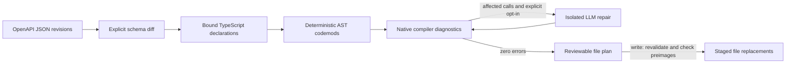

# Architecture

[Overview](../README.md) · [CLI guide](usage.md) · [Test evidence](evaluation.md)

AutoPatch separates planning from persistence. A migration result contains schema
changes, symbol evidence, compiler diagnostics, and exact file preimages/edits.
Only a verified result can be submitted to the writer.



1. Load the target project and require a clean baseline. The runner enables
   `strict` and every strict suboption, disables `noCheck` and library-check
   suppression, and performs no emit. Explicit permissive target flags cannot
   weaken the gate.
2. Match operations by **HTTP method + path**. Resolve SDK declarations through
   explicit bindings, never through a project-wide name guess.
3. Rename symbols with the TypeScript language service. Update interface
   property declarations through ts-morph AST APIs. No regex source replacement.
4. Check the **complete unsaved Project** with `getPreEmitDiagnostics()`.
   Errors outside supported call-site boundaries require manual work.
5. When explicitly enabled, repair affected bound API calls as one batch. Each
   response must parse as a single call with the same callee. Reject casts,
   non-null assertions, compiler directives, and inferred `any`/`never` values.
   Only a batch producing zero compiler errors is accepted.
6. Always restore the planning Project, including after successful previews.
   On `--write`, reload the project, install the proposed changes in memory,
   recheck diagnostics and file preimages, then persist them under a project lock.

A compiler pass proves type consistency, **not business correctness**. No model
output is executed by AutoPatch. Review business-logic changes and run the target
project's own tests before merging them.

## Source map

| Module | Responsibility |
| --- | --- |
| [CLI](../src/cli.ts) | Parse inputs, select preview/write, emit JSON or HTML |
| [Schema differ](../src/core/diff/openapi-differ.ts) | Classify supported changes and reject unknown contract changes |
| [Call-site finder](../src/core/ast/callsite-finder.ts) | Resolve direct calls by symbol identity |
| [Codemods](../src/core/ast/codemod-builder.ts) | Resolve bindings and mutate TypeScript ASTs |
| [Rename safety](../src/core/ast/rename-safety.ts) | Reject structural flows a symbol rename cannot safely cover |
| [Change evidence](../src/core/ast/change-evidence.ts) | Capture baseline declarations and references for review |
| [Migration runner](../src/core/runner/migration.ts) | Check baseline, orchestrate edits/repair, restore the planning project |
| [Compiler gate](../src/core/runner/type-checker.ts) | Enforce native strict diagnostics without emit |
| [LLM repair](../src/core/agent/llm-fixer.ts) | Validate isolated call replacements and bounded repair batches |
| [Provider transports](../src/core/agent/providers.ts) | Bound OpenAI/Anthropic requests through native fetch |
| [Patch writer](../src/core/runner/patch-writer.ts) | Revalidate plans, check preimages, persist and recover |
| [HTML report](../src/report/html-report.ts) | Render escaped migration evidence without scripts or network requests |

## Development

Use focused Conventional Commits and pull requests. Add a failing behavior test
before changing a module; prefer real AST projects and filesystem fixtures.
Mock external transport or targeted filesystem failures only. Run:

```sh
npm run typecheck  # Project.getPreEmitDiagnostics(), no shell tsc
npm test
npm run demo
```

The [test protocol](evaluation.md) documents the authored corpus, generated SDK
checks, historical release cases, and their limits. [Past reviews](reviews/)
record reproduced failures and fixes.
