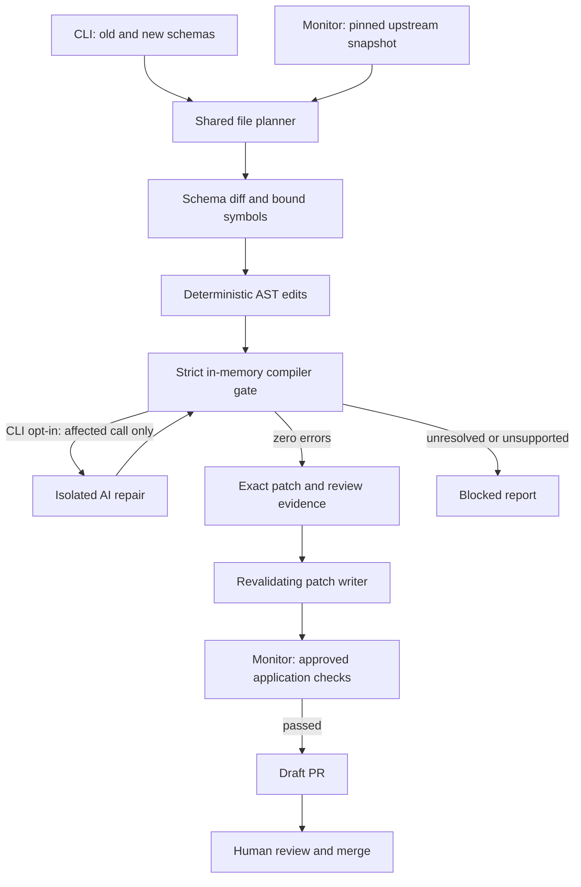

# Architecture

[Overview](../README.md) · [CLI guide](usage.md) · [Monitoring](monitoring.md) · [Test evidence](evaluation.md)

AutoPatch turns supported API contract changes into TypeScript patches for human
review. It runs beside an application during maintenance, not in the payment path.
There is no hosted backend or database: configuration, Git, and report artifacts
hold the state.



## The flow

1. **Read the inputs.** The CLI accepts two OpenAPI JSON versions, a TypeScript
   project, and bindings. Bindings map API definitions to local exports. The
   monitor downloads a specific GitHub revision and extracts configured schemas
   and fields from JSON or YAML.
2. **Find the changes.** The differ matches operations by HTTP method and path.
   Property renames need explicit provenance. Unsupported contract changes stop
   the migration; provider names do not select special codemods.
3. **Find and edit the code.** ts-morph exposes the AST: functions, imports,
   properties, and calls as structured nodes. Symbol identity connects an API
   declaration to its uses. Language-service renames and AST mutations handle
   supported changes. Safety checks reject structural flows they cannot prove.
4. **Check the whole project.** Both the original and modified project must pass
   native TypeScript diagnostics. AutoPatch enforces strict checking, disables
   `noCheck` and library-check suppression, and calls `getPreEmitDiagnostics()`
   without emitting files or spawning shell `tsc`.
5. **Optionally repair a call.** The CLI can enable a bounded model loop. Its
   dynamic context contains only the affected call and schema changes. A response
   must be one call with the same callee; casts, compiler directives, non-null
   assertions, and inferred `any`/`never` values are rejected. The complete repair
   batch must compile. Monitoring never enables this path.
6. **Produce a plan, then save explicitly.** Planning restores the in-memory
   project, even after success. Each proposed edit includes original and new
   text. The writer reloads and rechecks the project, checks those originals for
   concurrent edits, and persists under a project lock.
7. **Prepare a review.** The monitor applies the plan in a disposable checkout,
   updates tracked snapshots, runs configured application checks, rechecks the
   compiler, and stages the exact patch. The publisher validates its identity,
   reuses prior deliveries, and opens a draft PR. Failed runs publish no patch;
   monitor notices and artifacts explain what needs attention.

**Compilation proves type consistency, not business correctness.** The core
planner and writer do not execute the application. Approved monitor checks do;
those commands are trusted and need their own meaningful assertions. A person
reviews billing policy and decides whether to merge.

## Source map

| Module | Responsibility |
| --- | --- |
| [CLI](../src/cli.ts) | Flags, preview/write, JSON and HTML output |
| [File planner](../src/core/runner/file-planner.ts) | Shared file loading and typed migration planning for CLI and workflows |
| [Schema differ](../src/core/diff/openapi-differ.ts) | Supported changes and unsupported-contract findings |
| [AST modules](../src/core/ast/) | Bindings, symbol references, deterministic edits, rename safety, and evidence |
| [Migration runner](../src/core/runner/migration.ts) | Coordinate planning, optional repair, and restoration |
| [Compiler gate](../src/core/runner/type-checker.ts) | Strict native diagnostics in memory |
| [AI modules](../src/core/agent/) | Isolated replacement validation and bounded provider transport |
| [Patch writer](../src/core/runner/patch-writer.ts) | Revalidate and persist with concurrency checks and recovery |
| [Upstream reader](../src/automation/upstream.ts) | Pinned downloads, parsing, and selected contract projection |
| [Monitor](../src/automation/monitor.ts) | Configuration, preparation, application checks, artifacts, and status |
| [Publisher](../src/automation/publish.ts) | Exact-patch validation, draft PRs, retries, and GitHub notices |
| [HTML report](../src/report/html-report.ts) | Standalone escaped review evidence; no scripts or network requests |

## Verification

Tests exercise public CLI and migration boundaries with real AST projects and
Git/filesystem fixtures. External HTTP and targeted filesystem failures are the
substituted boundaries. No paid model calls occur in the test suite. Run:

```sh
npm run typecheck
npm test
npm run demo
npm run evaluate
```

Use focused Conventional Commits and pull requests. The [test protocol](evaluation.md)
separates authored cases, generated SDK checks, and historical releases from
unmeasured customer coverage.
