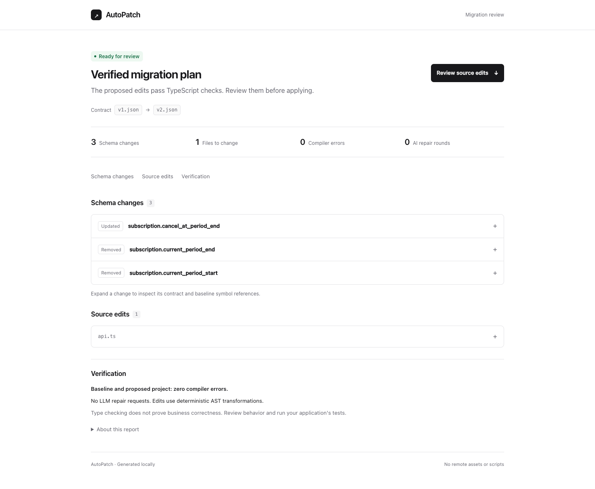

# Review a migration



Add `--report review.html` to any normal CLI invocation to export a standalone
HTML review. It uses the actual migration result, including blocked outcomes;
there is no separate UI migration engine. Open the file in a browser. There are
no remote fonts, assets, scripts, accounts, or database requirements.

```sh
npm run autopatch -- --from tests/fixtures/stripe/v1.json --to tests/fixtures/stripe/v2.json --project tests/fixtures/stripe/project/tsconfig.json --bindings tests/fixtures/stripe/project/bindings.json --report /tmp/stripe-review.html
```

The report opens with status and counts. Expand a schema change for its bound
declarations and references, or a file for exact before/after source. Blocking
findings remain visible; a verified plan with no edits reads “Already up to date.”
The JSON report includes `evidence`, indexed by `changeIndex`. Source locations
and snippets are captured from the baseline before mutation. Operation evidence
lists direct calls; schema evidence lists language-service references to the
property, or the interface for newly added properties. These references are not
complete runtime data-flow analysis.

Only a zero-error migration has writable files. A blocked report explains why
AutoPatch stopped. LLM round counts do not attribute each edit to a model response,
and compilation does not establish business correctness.

The report describes a **plan**, even with `--write`. It is exported before
persistence, so an invalid report destination cannot cause source writes. A
later persistence failure can leave a verified-plan report; the CLI exit status
and JSON `written` field remain the authority on whether source was persisted.
The `.html` destination must be new, its parent must exist, and it is created
with owner-only permissions. Existing files and symlinks are never overwritten.
Remove or choose a new report path explicitly when rerunning.

All dynamic content is HTML-escaped. A restrictive content security policy also
blocks scripts and network requests. The artifact contains source code and should
have the same access restrictions as its repository. Native disclosure controls,
keyboard navigation, mobile layout, system dark mode, and print styling work
without JavaScript. The compact visual design follows [Modern UI](https://modern-ui.org/);
the report uses local CSS and native HTML disclosures to remain portable.
